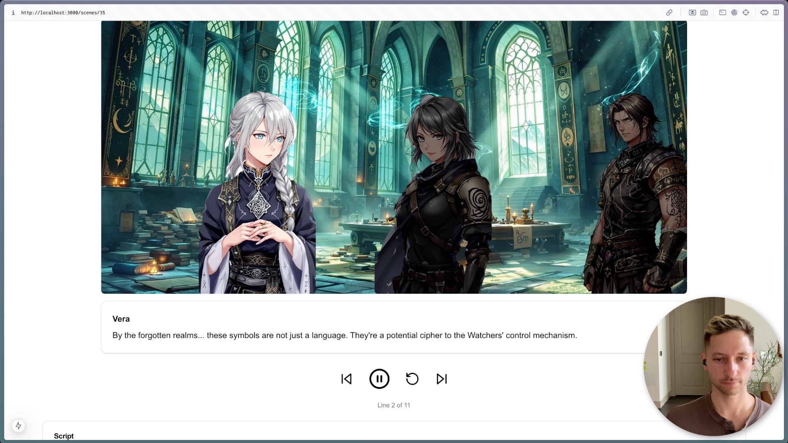

# Scene Creator



This is an LLM-powered web app that creates stories. It uses AI to create characters: complete with images and voice. It creates scripted scenes between the characters and creates images and music to go along with the scenes.

It uses:

- [Claude](https://claude.ai/) as the LLM
- [Flux hosted on Replicate](https://replicate.com/black-forest-labs/flux-1.1-pro-ultra) for image generation
- [ElevenLabs](https://elevenlabs.io/) for voice generation
- [Meta's musicgen](https://replicate.com/meta/musicgen) for music generation

Check out the [demo on YouTube](https://youtu.be/BFdUyKYq_bY)

## Getting Started

First, create a `.env` file to look like the `env.example` and fill in your API keys.

Update the voice options:

```bash
bun cache-voices
```

## Running the app

First, run the development server:

```bash
npm run dev
# or
yarn dev
# or
pnpm dev
# or
bun dev
```

Open [http://localhost:3000](http://localhost:3000) with your browser to see the result.

## Logging

All logs are written to `log.log` in the root directory.

To clear logs, run:

```bash
bun clear-logs
```
